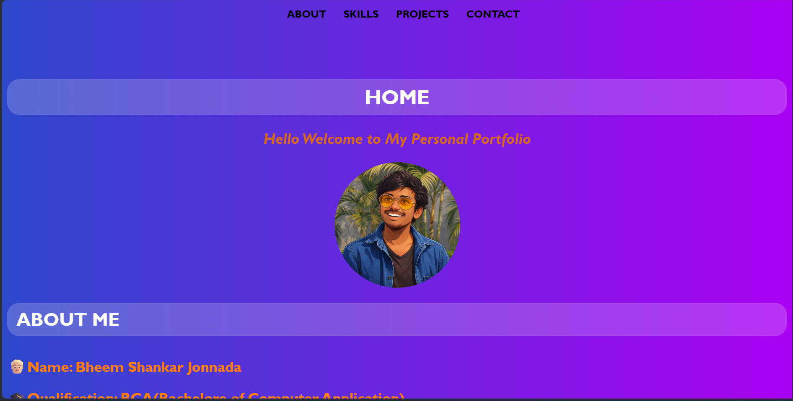
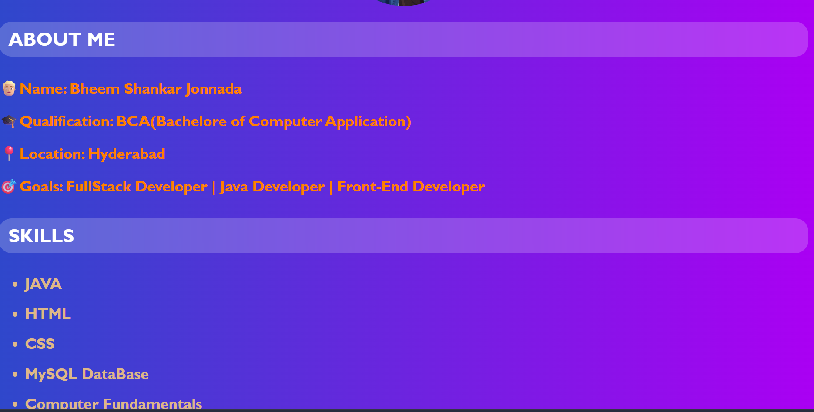
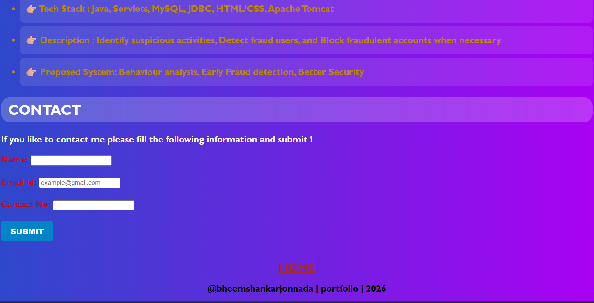

# CodeOrbit_PersonalPortfolio
This is my Personal Portfolio Website, built using HTML, CSS, and JavaScript. It serves as a digital resume and showcase of my skills, projects, and career goals. The site is fully responsive, adapting seamlessly to desktop, tablet, and mobile screens.

# CodeOrbit Personal Portfolio 🌐

This repository contains my personal portfolio project built with **HTML, CSS, and JavaScript**.  
It showcases my skills, projects, and achievements as I transition into the IT industry.

---

## 🚀 Features
- Responsive design for desktop and mobile
- Interactive UI with animations
- Sections for About, Skills, Projects, and Contact
- Clean and modern layout

---

## 🛠️ Tech Stack
- **Frontend:** HTML5, CSS3, JavaScript (DOM)
- **Styling:** Custom CSS, animations, hover effects
- **Version Control:** Git & GitHub

---

## 📂 Project Structure
Portfolio Task1/
├── index.html
├── style.css
├── script.js
└── assets/
├── images/
└── icons/

---

## 📸 Screenshots

### Home Page

### About Section

### Projects Section

### Contact Section

---

## 🔗 Live Demo
Once GitHub Pages is enabled, your portfolio will be live at:  
`https://bheemshankarjonnada.github.io/CodeOrbit_PersonalPortfolio/`

---

## 📬 Contact
- **Name:** Bheem Shankar Jonnada  
- **Location:** Hyderabad, India  
- **LinkedIn:** bheemshankarjonnada  
- **Email:** bheemshankarj2326@gmail.com

---

✨ *This portfolio is a reflection of my journey as an aspiring indie filmmaker and fresher IT professional.*
